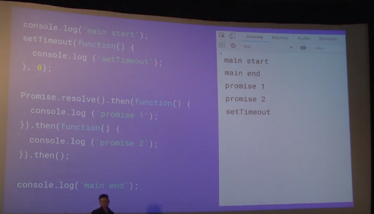

https://www.youtube.com/watch?v=ap7JzNNAeVo   最佳讲解视频

https://www.youtube.com/watch?v=8aGhZQkoFbQ

https://www.youtube.com/watch?v=cCOL7MC4Pl0

https://jakearchibald.com/2015/tasks-microtasks-queues-and-schedules/?utm_source=html5weekly

- task流程

	**UI Rendering比其他task 优先级更高**

	**web apis是由浏览器提供的，javascript中并没有这些**

- 增加microtask之后的流程如下：

- 增加浏览器render之后的流程如下：

	**60frames per second。一秒执行60次render。浏览器使用CPU进行render操作，只有部分操作，比如3D 动画由GPU执行**

	**RAF--requestAnimationFrame**
    **render优先级较其他task高，当该执行render操作时，会将render插入到task queue头部，但是是在microtask之后**
    

   **一次event loop中，只会执行一个task item。执行完之后，循环执行microtasks中的所有microtask,直至所有的microtask执行完，在执行过程中新增的microtask，也会在此次loop中执行。如果到达render执行时间，取出当前的所有的animation calbacks然后依次执行。执行过程中新增的animation calbacks,需要在下次render时执行，此执行过程同图11的逻辑**
   
- multiple event loop：

https://segmentfault.com/a/1190000013212944

https://segmentfault.com/a/1190000012646373

**根据HTML Standard，一轮事件循环执行结束之后，下轮事件循环执行之前开始进行UI render。即：macro-task任务执行完毕，接着执行完所有的micro-task任务后，此时本轮循环结束，开始执行UI render。UI render完毕之后接着下一轮循环。**
